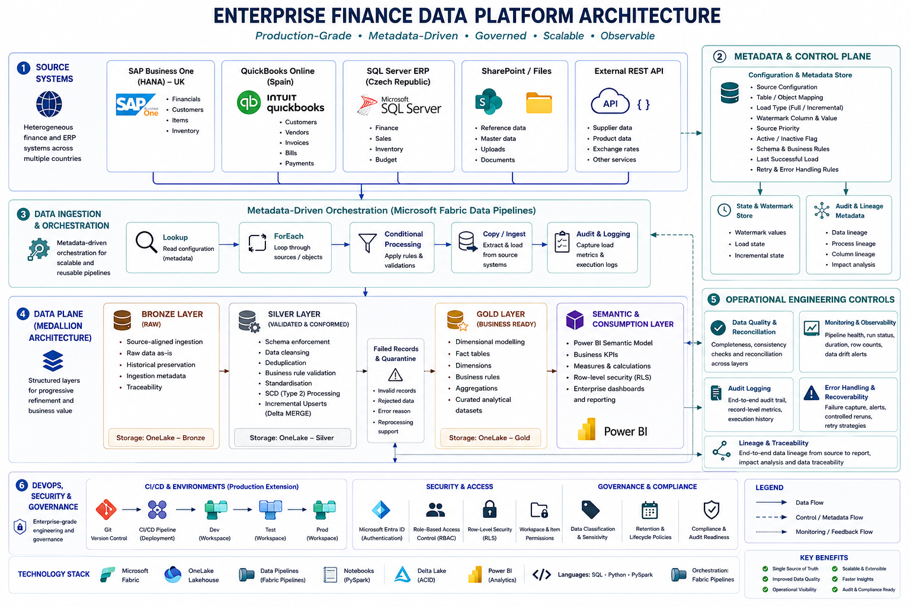
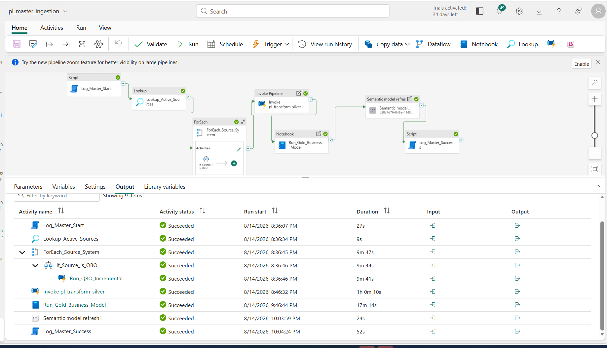
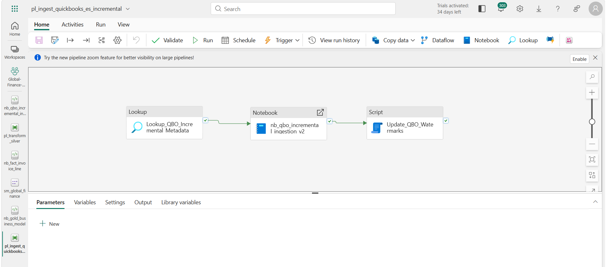
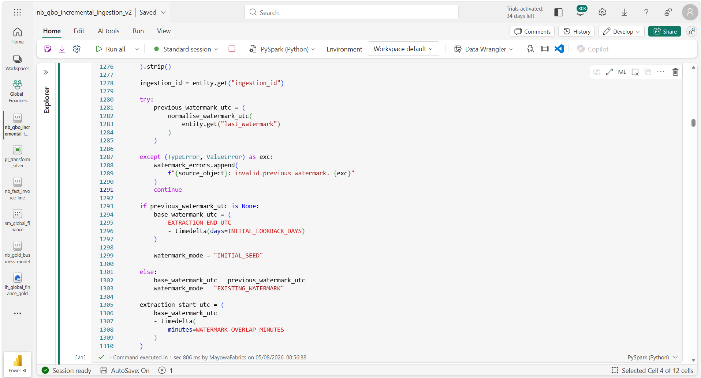
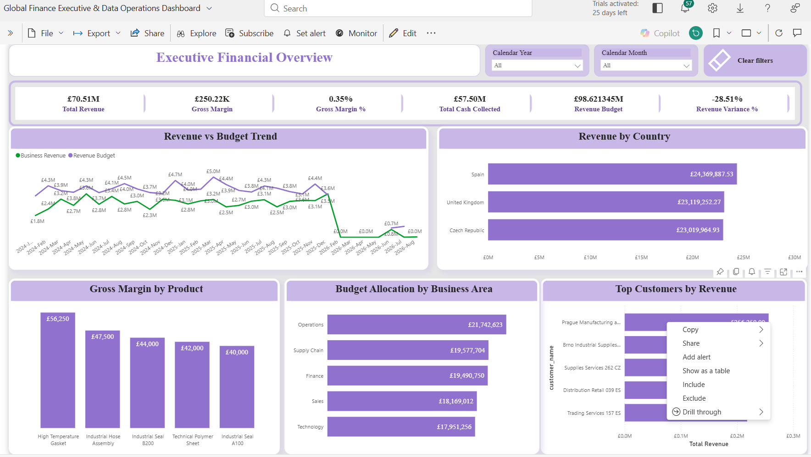

# Enterprise Finance Data Platform

Production-Grade Multi-Source Data Engineering Solution on Microsoft Fabric

End-to-end metadata-driven data platform integrating heterogeneous finance and ERP systems into a governed Lakehouse architecture for trusted analytics and enterprise reporting.

# Project Overview

This project demonstrates the design and implementation of a production-oriented enterprise data platform built on Microsoft Fabric to consolidate fragmented financial and operational data from multiple business entities and source systems.

The platform implements a metadata-driven ingestion framework, Medallion Architecture (Bronze, Silver and Gold), incremental data processing, data quality validation, audit logging, error handling, orchestration, dimensional modelling and semantic reporting.

The solution is designed around real-world Data Engineering principles including scalability, maintainability, observability, recoverability and data reliability.

# Business Problem

A multi-entity organisation operating across the United Kingdom, Spain and Czech Republic maintains financial and operational data across multiple independent systems.

The fragmented architecture creates several challenges:

* Inconsistent reporting across business entities
* Manual data consolidation and reconciliation
* Multiple versions of business-critical metrics
* Limited visibility into data pipeline failures
* Repeated ingestion and transformation logic
* Difficulty tracing data from source systems to reporting
* Limited scalability when onboarding additional datasets

The objective of this project is to engineer a centralised, governed and scalable data platform that provides a reliable single source of truth for downstream analytics and reporting.

## Solution Architecture
The platform follows a layered, metadata-driven architecture designed to separate source ingestion, data transformation, business modelling and analytical consumption.

### Architecture Flow

#### Source Systems
SAP Business One (HANA) • QuickBooks Online • SQL Server ERP • SharePoint • REST API

↓

#### Metadata-Driven Ingestion & Orchestration
Configuration-driven pipelines • Lookup • ForEach • Conditional processing • Parameterised ingestion

↓

#### Bronze Layer — Raw
Source-aligned ingestion • Raw historical preservation • Ingestion metadata • Traceability

↓

#### Silver Layer — Validated & Conformed
Schema enforcement • Data cleansing • Deduplication • Business-rule validation • Standardisation • SCD Type 2 where applicable • Incremental Delta MERGE

↓

#### Gold Layer — Business Ready
Dimensional modelling • Fact tables • Dimensions • Business rules • Curated analytical datasets

↓

#### Semantic & Consumption Layer
Power BI Semantic Model • Business KPIs • Enterprise dashboards and reporting

### Cross-Cutting Engineering Controls

The architecture is supported by operational controls across the end-to-end data lifecycle:

* Metadata & Configuration Management — controls source onboarding and pipeline behaviour
* Data Quality & Reconciliation — validates completeness, consistency and business rules
* Audit Logging — captures pipeline execution, processing status and record-level metrics
* Error Handling & Recoverability — captures failures and supports controlled reruns
* Monitoring & Observability — provides visibility into pipeline health and failed processing stages
* Incremental Processing — reduces unnecessary reprocessing through watermark-driven ingestion and Delta MERGE

## Pipeline Orchestration & Execution

The master orchestration pipeline coordinates the end-to-end execution of the data platform, from source ingestion through transformation, business modelling and semantic model refresh.

The orchestration sequence includes:

- Execution start logging
- Metadata-driven source discovery
- Dynamic source-system processing
- Silver-layer transformation
- Gold-layer business modelling
- Power BI semantic model refresh
- Final execution status logging

The execution below demonstrates a successful end-to-end platform run.

### Dependency-Aware Silver Transformation

Silver-layer processing is orchestrated according to data dependencies. Foundational dimensions are processed before dependent dimensions and fact datasets to support referential integrity and controlled transformation sequencing.

The pipeline coordinates notebook-based transformations across dimensions, transactional facts and downstream datasets.

## Incremental Ingestion & Watermark Management

The platform implements metadata-driven incremental ingestion to minimise unnecessary source extraction and support reliable restartable processing.

### Metadata-Driven Incremental Pipeline

The QuickBooks ingestion pipeline retrieves incremental configuration from the metadata control layer, executes the parameterised ingestion notebook, and updates watermark state only after successful processing.

### Watermark Resolution Logic

Incremental extraction windows are resolved dynamically for each configured entity. The implementation reads the previous successful watermark, supports initial seeding for new entities, applies a configurable overlap to protect against timestamp boundary conditions, and calculates the effective extraction start time for each run.

## Gold Layer & Semantic Model

The Gold layer transforms validated and conformed data into business-ready dimensional structures for enterprise finance analytics.

Curated fact and dimension tables are exposed through the Power BI semantic model, where relationships, business measures and analytical structures provide a consistent reporting layer across the organisation.

Key modelling principles include:

- Conformed dimensions across source systems
- Surrogate keys for dimensional relationships
- Fact tables defined at explicit business grain
- Centralised business measures and calculations
- Controlled relationships between facts and dimensions
- Analytics-ready structures for enterprise reporting

## Analytics & Business Outcomes

The Power BI reporting layer consumes the curated Gold-layer data through the enterprise semantic model, providing a consistent view of financial and operational performance across the organisation.

The reporting solution enables stakeholders to analyse:

- Revenue and profitability performance
- Budget versus actual performance
- Customer and product performance
- Accounts receivable and cash collection
- Inventory performance
- Financial position and general ledger reporting

The semantic model centralises business measures and reporting logic, ensuring that dashboards use consistent definitions across business entities.

## Analytics & Business Consumption

The curated Gold-layer datasets are exposed through a Power BI semantic model, providing a consistent analytical layer across the three business entities.

The reporting layer supports executive and finance analysis across revenue, gross margin, budget performance, customers, products and financial position.

The dashboard demonstrates the final consumption path of the platform:

**Source Systems → Bronze → Silver → Gold → Semantic Model → Power BI**

Rather than embedding business logic independently within individual reports, reusable measures and analytical relationships are maintained through the semantic model to provide consistent reporting across the platform.

## Data Quality & Validation

Data quality controls are integrated into the processing lifecycle to validate data before it is consumed by downstream reporting.

Validation results are captured and exposed through an operational dashboard, providing visibility into passed and failed checks, expected and observed values, and validation timestamps.

This provides an auditable view of data quality and helps identify issues before unreliable data reaches business reporting.

## Pipeline Monitoring & Observability

Pipeline execution metadata is captured to provide operational visibility across the platform.

The monitoring layer tracks pipeline runs, execution status, processing duration, records written and source-object activity, enabling failed or abnormal processing to be identified and investigated.

This closes the operational loop between ingestion, transformation and reporting by making pipeline health and data-processing outcomes visible from a central monitoring view.

## Engineering Design Highlights

The platform was designed around reusable engineering patterns rather than source-specific pipelines.

### Metadata-Driven Processing

Source and entity behaviour is controlled through metadata, allowing ingestion logic to be reused across multiple datasets without duplicating pipeline implementations.

Configuration controls include source and object identification, load behaviour, processing sequence, watermark configuration and active/inactive status.

### Full and Incremental Load Strategy

The ingestion framework supports different load strategies based on source and entity requirements.

Initial loads establish the baseline dataset, while subsequent incremental loads process only new or changed records using stored watermark state.

For incremental processing, the last successful watermark is persisted only after successful completion, preventing failed runs from incorrectly advancing the extraction boundary.

### Idempotency & Recoverability

Incremental processing is designed to support safe reruns.

A configurable watermark overlap protects against late-arriving records and timestamp-boundary conditions, while downstream Delta MERGE processing prevents overlapping extraction windows from creating duplicate business records.

Failed executions do not advance the successful watermark, allowing the next run to restart from the previously committed processing state.

### Dependency-Aware Transformation

Transformation workloads are executed according to dataset dependencies.

Foundational dimensions are processed before dependent dimensions and fact tables, helping maintain referential integrity and predictable transformation sequencing across the Silver and Gold layers.

### Data Quality & Reconciliation

Data quality checks are incorporated into the processing lifecycle rather than treated as a reporting-only activity.

Validation results, expected and observed values, processing status and execution timestamps are captured for operational monitoring and investigation.

### Observability

Pipeline and data-processing metrics are persisted for operational monitoring, including execution status, processing duration, records written, validation results and source-object activity.

These metrics feed the Power BI monitoring layer, providing visibility from pipeline execution through to data quality outcomes.

## Technology Stack

| Area | Technology |
|---|---|
| Data Platform | Microsoft Fabric |
| Storage | OneLake / Lakehouse |
| Orchestration | Fabric Data Pipelines |
| Processing | PySpark, Python, SQL |
| Table Format | Delta Lake |
| Source Systems | SAP Business One (HANA), QuickBooks Online, SQL Server ERP, SharePoint, REST API |
| Data Architecture | Medallion Architecture |
| Data Modelling | Dimensional Modelling, Star Schema |
| Incremental Processing | Watermark-Based Extraction, Delta MERGE |
| Analytics | Power BI Semantic Model, Power BI |
| Monitoring | Audit Logging, Data Quality Metrics, Pipeline Execution Metrics |
| Version Control | Git / GitHub |

## Key Engineering Outcomes

- Consolidated heterogeneous finance and ERP sources into a common Fabric data platform.
- Replaced source-specific ingestion patterns with reusable metadata-driven orchestration.
- Implemented incremental processing with persistent watermark state and controlled restart behaviour.
- Established Bronze, Silver and Gold processing boundaries for raw preservation, conformance and business modelling.
- Implemented dependency-aware transformation and Delta MERGE processing.
- Integrated data quality validation, audit logging and pipeline execution monitoring.
- Built a dimensional Gold layer and reusable Power BI semantic model for cross-entity reporting.
- Exposed both business analytics and platform operational health through Power BI.
